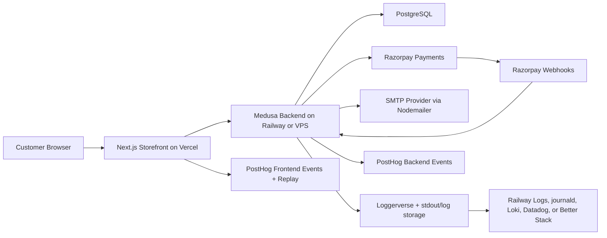

# Final Recommended Architecture

This architecture keeps the stack production-ready while staying understandable for a small ecommerce team.

## System Overview



## Frontend

Location:

```txt
apps/storefront
```

Responsibilities:

- Product browsing, cart UX, checkout UX, account pages, order confirmation.
- Client-side PostHog tracking for intent and funnel behavior.
- Session replay with strict masking.
- Sends requests to Medusa Store API using the existing SDK in `src/lib/config.ts`.

Recommended additions:

```txt
apps/storefront/instrumentation-client.ts
apps/storefront/src/lib/analytics/client.ts
apps/storefront/src/lib/analytics/events.ts
apps/storefront/src/modules/analytics/posthog-pageview.tsx
apps/storefront/src/modules/analytics/identify-customer.tsx
```

Deployment:

- Vercel.
- Set only `NEXT_PUBLIC_*` browser-safe variables.
- Use Vercel preview deployments for storefront changes.

## Backend

Location:

```txt
apps/backend
```

Responsibilities:

- Commerce source of truth through Medusa.
- Orders, carts, customers, regions, products, payments, notifications.
- Backend logging through Loggerverse via Medusa logger override.
- Backend analytics through Medusa Analytics Module and PostHog provider.
- Email through custom Nodemailer notification module.
- Planned Razorpay provider and webhook processing.

Recommended additions:

```txt
apps/backend/src/utils/loggerverse.ts
apps/backend/src/utils/medusa-logger.ts
apps/backend/src/utils/analytics-events.ts
apps/backend/src/api/middlewares.ts
apps/backend/src/workflows/track-order-placed.ts
apps/backend/src/subscribers/order-placed.ts
```

Deployment:

- Railway for managed simplicity.
- VPS for more control over persistent logs and process management.
- Always run migrations before production startup.

## Database

Use PostgreSQL as the durable state store.

Recommendations:

- Managed Postgres for Railway deployment.
- Automated backups enabled.
- Separate production and staging databases.
- Never log `DATABASE_URL`.
- Keep Medusa migrations in the backend deploy process.

## Payments

Current repo:

- Storefront checkout code is still Medusa starter Stripe/manual style.
- Razorpay code is not present yet.

Recommended Razorpay architecture:

- Implement Razorpay as the production payment provider.
- Use backend webhook verification as payment source of truth.
- Track frontend `payment_started` when the customer begins payment.
- Track backend `payment_success` or `payment_failed` only after verified provider/webhook result.
- Store only safe gateway IDs in logs and analytics.

Future backend route:

```txt
apps/backend/src/api/store/razorpay/webhook/route.ts
```

Do not log raw payment payloads, card data, UPI identifiers, signatures, or webhook secrets.

## Email

Current module:

```txt
apps/backend/src/modules/email/service.ts
apps/backend/src/modules/email/templates/password-reset.tsx
```

Recommended behavior:

- Log email lifecycle with template, provider, and message ID.
- Track `email_sent` and `email_failed` only with safe metadata.
- Do not log rendered HTML, reset URLs, reset tokens, or SMTP credentials.
- Consider a production email provider with dashboards and bounce handling when volume increases.

## Logging

Backend logging path:

1. Loggerverse instance in `src/utils/loggerverse.ts`.
2. Medusa logger adapter in `src/utils/medusa-logger.ts`.
3. Registered in `medusa-config.ts`.
4. Custom code resolves `container.resolve("logger")`.
5. Request middleware adds `request_id` and request duration.

Production sink strategy:

- Railway: stdout/stderr plus log drain.
- VPS: stdout/stderr plus persistent Loggerverse files under `/var/log/medusa-store`.
- Centralized search: Better Stack, Datadog, Grafana Loki, or OpenSearch.

## Analytics

Frontend:

- `posthog-js` in `instrumentation-client.ts`.
- Track intent and UX funnel events.
- Identify customers with Medusa `customer.id`.
- Mask session replay heavily.

Backend:

- Medusa Analytics Module with `@medusajs/analytics-posthog`.
- Track durable business outcomes from subscribers/workflows/webhooks.
- Use same `customer.id` as `actor_id` when available.

Rule:

- Frontend tells you what the customer tried.
- Backend tells you what actually happened.

## Storage

Recommended production storage:

- PostgreSQL for commerce state.
- S3-compatible storage for product/media files when the local file module is no longer enough.
- Centralized logging storage for production logs.
- PostHog for analytics, not log storage.

## Observability

Minimum production observability:

- Loggerverse structured logs.
- Request IDs in every backend response.
- PostHog frontend funnel dashboard.
- PostHog backend revenue/payment events.
- Alerts for backend 5xx spikes, payment failures, webhook failures, and email failures.
- Uptime monitoring for storefront and backend health endpoints.
- Database backup monitoring.

Later improvements:

- OpenTelemetry through `apps/backend/instrumentation.ts`.
- Error tracking with Sentry or PostHog error tracking.
- Redis event bus/workflow engine for production Medusa scaling.
- Log-based metrics for slow APIs and webhook retries.

## Correlation Model

Use shared identifiers across logs and analytics:

| Identifier | Where generated | Where used |
| --- | --- | --- |
| `request_id` | Backend middleware | Logs, API responses, analytics properties |
| `cart_id` | Medusa cart | Cart and checkout funnel |
| `order_id` | Medusa order | Revenue, payment, email, refund, support |
| `customer_id` | Medusa customer | PostHog distinct ID and backend `actor_id` |
| `razorpay_payment_id` | Razorpay | Payment debugging without raw payloads |
| `message_id` | SMTP provider | Email delivery debugging |

## Recommended Production Defaults

- `LOG_LEVEL=info`
- `LOG_TO_FILE=false` on Railway
- `LOG_TO_FILE=true` on VPS
- `POSTHOG_BACKEND_ENABLED=true` in production
- `NEXT_PUBLIC_POSTHOG_ENABLED=true` in production
- `NEXT_PUBLIC_POSTHOG_SESSION_REPLAY=true` only after masking is verified
- Loggerverse dashboard disabled unless protected
- Backend analytics emitted from subscribers/workflows, not only storefront pages

